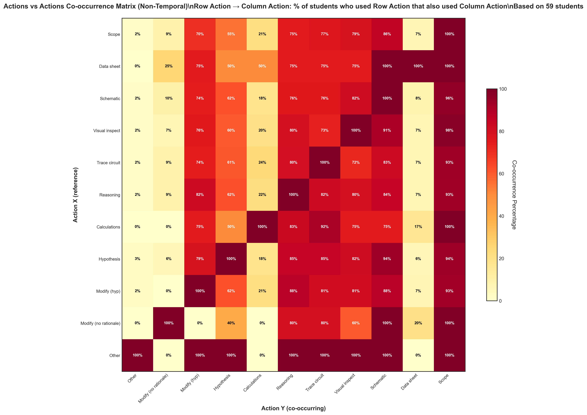

# Action Non-Temporal Co-occurrence (Updated Analysis)

## Takeaway
Updated version of the non-temporal co-occurrence matrix with refined methodology. Shows when actions occur together across a student's entire session, with improved data processing and visualization.

## What's Important About This Figure
This updated analysis likely incorporates methodological improvements from the continued research effort, potentially addressing issues discovered in the original Phase 1 analysis.

## Original Filename
`actions_vs_actions_nontemporal_cooccurrence.png` (from continued_results)

## Related Figures
- [Original Phase 1 Version](../../../Phase_1/Action_NonTemporal_Cooccurrence/) - Original analysis for comparison
- [Temporal Updated Version](../Action_Temporal_Cooccurrence/) - Temporal version of this updated analysis

## Code
See the updated code in [code.py](./code.py)

## Figure

