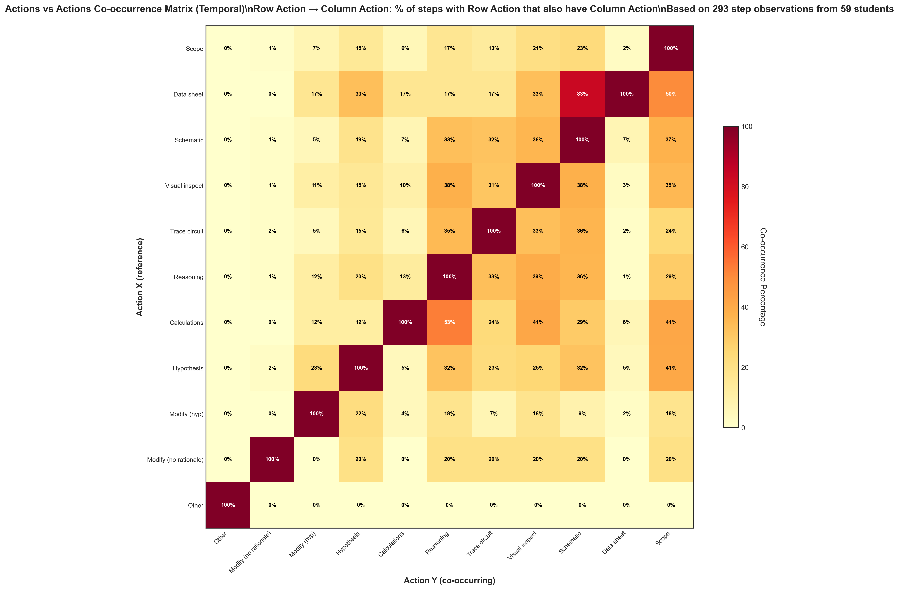

# Action Temporal Co-occurrence (Updated Analysis)

## Takeaway
Updated version of the temporal co-occurrence matrix analysis with refined methodology. Shows when actions occur together in the same step, with each cell displaying: "Of steps where Row Action occurred, what percentage also had Column Action?"

## What's Important About This Figure
This is an updated analysis of the Phase 1 temporal co-occurrence patterns, likely incorporating:
- Refined data processing methods
- Improved visualization techniques
- Corrected calculation methodologies
- Enhanced statistical accuracy

## Original Filename
`actions_vs_actions_temporal_cooccurrence.png` (from continued_results)

## Related Figures
- [Original Phase 1 Version](../../../Phase_1/Action_Temporal_Cooccurrence/) - Original analysis for comparison
- [Action NonTemporal Updated](../Action_NonTemporal_Cooccurrence/) - Non-temporal version of this updated analysis

## Code
See the updated code in [code.py](./code.py)

## Figure

