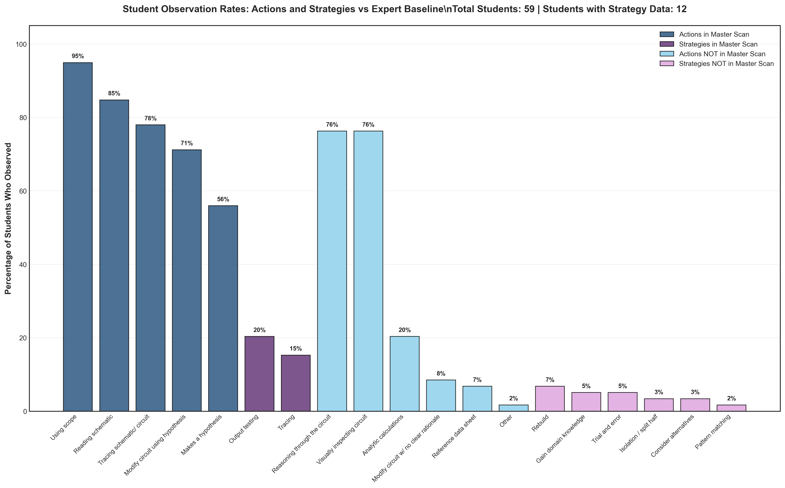

# Over/Under Observed Analysis (Updated)

## Takeaway
Updated version of the over/under observed analysis with refined methodology for comparing student observation patterns against the expert baseline. This updated analysis likely addresses methodological issues discovered in the original Phase 1 version.

## What's Important About This Figure
This updated analysis represents continued refinement of the observation accuracy assessment, potentially incorporating:
- Improved statistical methods
- Refined categorization of over/under observation
- Enhanced visualization of observation patterns
- Corrected data processing issues

## Original Filename
`over_under_observed_analysis.png` (from continued_results)

## Related Figures
- [Original Phase 1 Version](../../../Phase_1/Over_Under_Observed_Analysis/) - Original analysis for comparison
- [Student Distribution vs Expert](../../../Phase_1/Student_Distribution_vs_Expert/) - Related observation accuracy analysis

## Code
See the updated code in [code.py](./code.py)

## Figure

