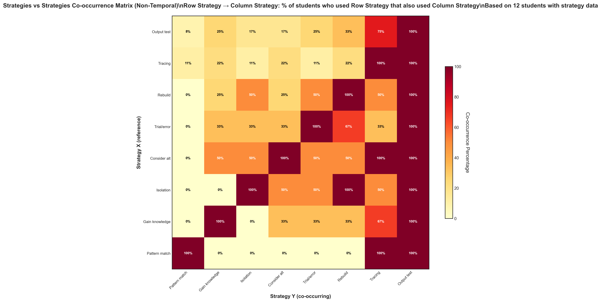

# Strategies Non-Temporal Co-occurrence (Updated)

## Takeaway
Updated version of the strategies non-temporal co-occurrence analysis with refined methodology for examining strategy relationships across entire student sessions.

## What's Important About This Figure
This updated analysis represents continued refinement of strategy co-occurrence patterns, limited to the 12 students with strategy data from the NEW observation sheets.

## Original Filename
`strategies_vs_strategies_nontemporal_cooccurrence.png` (from continued_results)

## Related Figures
- [Original Phase 1 Version](../../../Phase_1/Strategies_NonTemporal_Cooccurrence/) - Original analysis for comparison
- [Strategies Temporal Updated](../Strategies_Temporal_Cooccurrence/) - Temporal version of this updated analysis

## Code
*Note: Updated code file not found in repository*

## Figure

