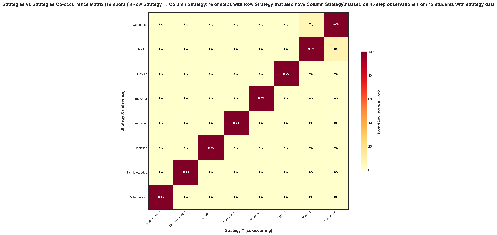

# Strategies Temporal Co-occurrence (Updated)

## Takeaway
Updated version of the strategies temporal co-occurrence analysis with refined methodology for examining when strategies occur together in the same troubleshooting step.

## What's Important About This Figure
This updated analysis represents continued refinement of temporal strategy patterns, focusing on the subset of students with strategy data and incorporating methodological improvements.

## Original Filename
`strategies_vs_strategies_temporal_cooccurrence.png` (from continued_results)

## Related Figures
- [Original Phase 1 Version](../../../Phase_1/Strategies_Temporal_Cooccurrence/) - Original analysis for comparison
- [July 17 Plus1 Analysis](../../July_17_Results/Strategies_Temporal_Plus1/) - Advanced sequential strategy analysis

## Code
*Note: Updated code file not found in repository*

## Figure

