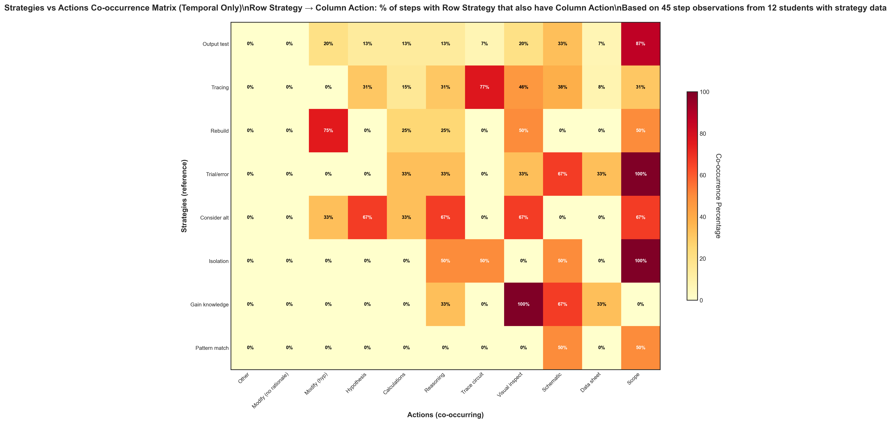

# Strategies vs Actions Temporal (Updated)

## Takeaway
Updated version of the strategies vs actions temporal co-occurrence analysis. Shows refined methodology for examining when strategies and actions occur together in the same step.

## What's Important About This Figure
This updated analysis of strategy-action relationships represents continued refinement of the temporal co-occurrence methodology for the subset of students with strategy data.

## Original Filename
`strategies_vs_actions_temporal_cooccurrence.png` (from continued_results)

## Related Figures
- [Original Phase 1 Version](../../../Phase_1/Strategies_vs_Actions_Temporal/) - Original analysis for comparison
- [July 17 Strategies Analysis](../../July_17_Results/Strategies_Temporal_Plus1/) - Advanced temporal strategy analysis

## Code
*Note: Updated code file not found in repository*

## Figure

