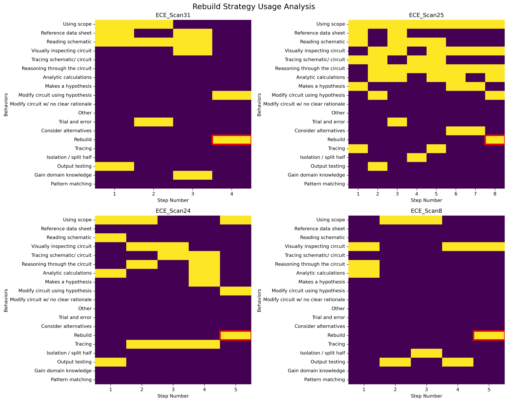

# Rebuild Students Analysis

## Takeaway
This analysis examines the 4 students who used the 'Rebuild' strategy during their troubleshooting process. All rebuild instances occurred in the final troubleshooting step, suggesting rebuild represents a last-resort strategy when other approaches have failed. The most common concurrent behaviors with rebuild are "Modify circuit using hypothesis" (3 times) and "Using scope" (2 times), indicating students attempt systematic repairs even when rebuilding.

## What's Important About This Figure
This detailed analysis reveals critical insights about the rebuild strategy:
- **Last Resort Strategy**: All 4 students used rebuild in their final step
- **Systematic Approach**: Even when rebuilding, students maintain hypothesis-driven modifications
- **Pattern Recognition**: Rebuild typically follows visual inspection and reasoning phases
- **Strategic Context**: Represents recognition that current approach isn't working

The pattern suggests rebuild is not random trial-and-error but a deliberate strategic pivot.

## Original Filename
`rebuild_students_analysis.png`

## Related Figures
- [Trial Error Reasoning Cooccurrence](../Trial_Error_Reasoning_Cooccurrence/) - Shows relationship between rebuild, trial-and-error, and reasoning
- [Strategies Temporal Plus1](../Strategies_Temporal_Plus1/) - Advanced temporal analysis of strategy sequences

## Code
See the full code in [code.py](./code.py)

## Figure

