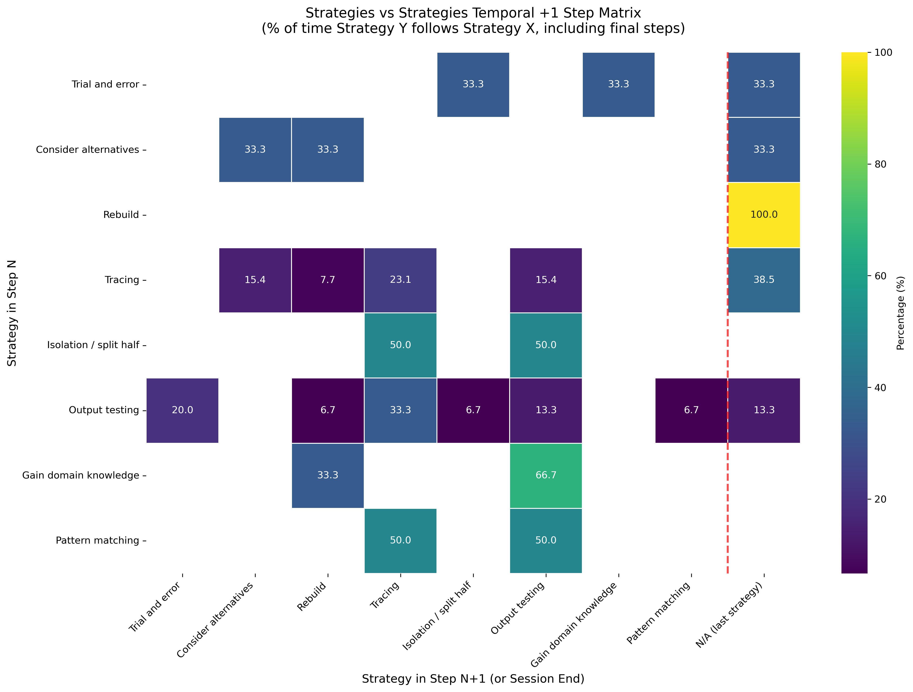

# Strategies Temporal Plus1 Analysis

## Takeaway
This advanced temporal analysis examines strategy sequences by tracking what happens in the step immediately following each strategy. Key findings: Rebuild is always final (100% terminal), Gain domain knowledge leads to Output testing (66.7%), and certain strategies show strong sequential patterns. Analysis based on 12 students with strategy data across 45 strategy observations.

## What's Important About This Figure
This sophisticated temporal analysis reveals critical strategy progression patterns:
- **Terminal Strategies**: Rebuild always ends sessions (100% final step rate)
- **Sequential Logic**: Strong patterns like "Gain domain knowledge → Output testing" (66.7%)
- **Strategy Persistence**: Some strategies continue while others transition
- **Completion Indicators**: Final step analysis reveals successful completion patterns

The plus-one temporal approach provides insights into strategic thinking progression that simple co-occurrence cannot capture.

## Original Filename
`strategies_vs_strategies_temporal_plus1.png`

## Related Figures
- [Strategies Temporal Cooccurrence](../../../Phase_1/Strategies_Temporal_Cooccurrence/) - Standard temporal co-occurrence analysis
- [Rebuild Students Analysis](../Rebuild_Students_Analysis/) - Detailed analysis of rebuild strategy users

## Code
See the full code in [code.py](./code.py)

## Figure

