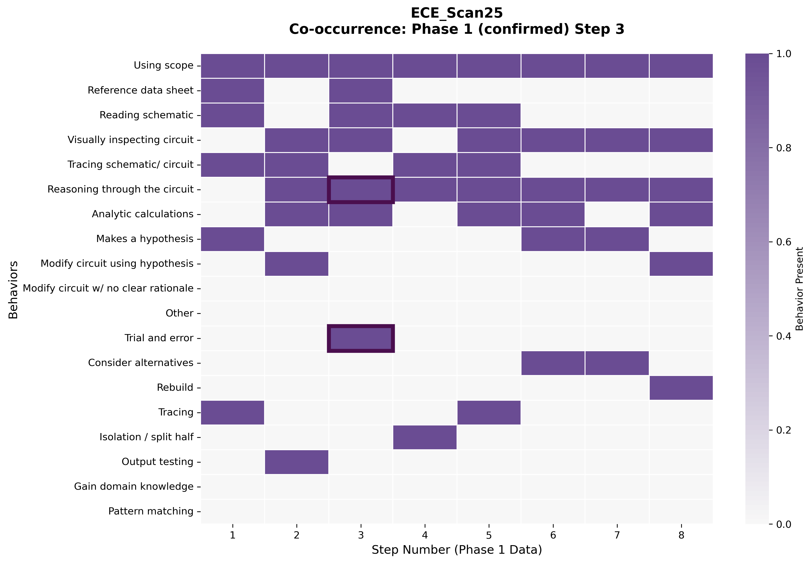

# Trial and Error + Reasoning Co-occurrence Analysis

## Takeaway
This analysis examines the rare instances where students used both 'Trial and error' and 'Reasoning through the circuit' strategies simultaneously. Only 1 student (ECE_Scan25) demonstrated this co-occurrence pattern in 1 step out of 293 total observations, revealing this as an extremely rare but potentially significant troubleshooting behavior.

## What's Important About This Figure
This analysis highlights a fascinating paradox in troubleshooting behavior:
- **Theoretical Opposition**: Trial and error typically implies experimentation without clear hypothesis, while reasoning implies systematic analysis
- **Rare Co-occurrence**: Only 1 instance across 59 students and 293 observations
- **Sophisticated Problem-Solving**: May represent transition moments or advanced troubleshooting approaches
- **Student ECE_Scan25**: The only student to demonstrate this pattern used reasoning in 7/8 steps but combined it with trial and error in step 3

The rarity suggests this represents either a transition between strategies or a sophisticated hybrid approach.

## Original Filename
`trial_error_reasoning_cooccurrence.png`

## Related Figures
- [Rebuild Students Analysis](../Rebuild_Students_Analysis/) - ECE_Scan25 also used the rebuild strategy
- [Strategies Temporal Plus1](../Strategies_Temporal_Plus1/) - Shows strategy progression patterns

## Code
See the full code in [code.py](./code.py)

## Figure

