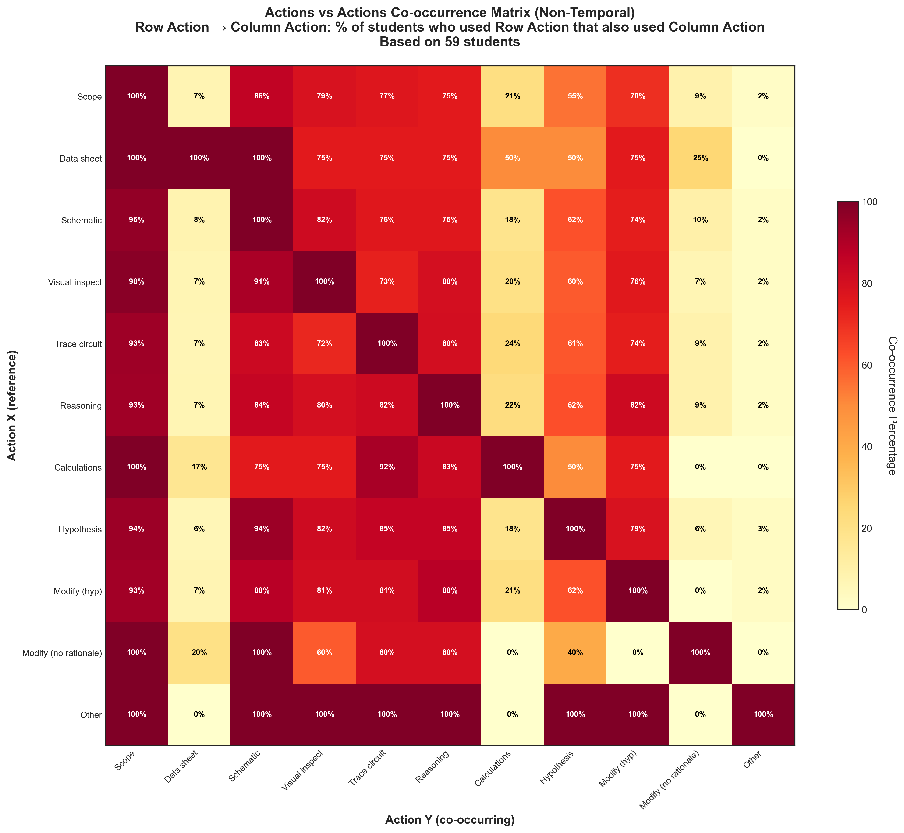

# Action Non-Temporal Co-occurrence Analysis

## Takeaway
Non-temporal co-occurrence matrix showing when actions occur together across a student's entire session. Each cell shows: "Of students who used Row Action anywhere, what percentage also used Column Action anywhere?"

Analysis based on 59 students. Diagonal shows 100% (students always co-occur with themselves).

## What's Important About This Figure
This visualization provides a broader view of student troubleshooting behaviors by examining which actions tend to appear in the same student's repertoire, regardless of timing. It reveals:
- Which actions form part of a student's overall troubleshooting approach
- Actions that are typically used by the same students vs. those representing alternative approaches
- The diversity of action combinations across the student population

## Original Filename
`actions_vs_actions_nontemporal_cooccurrence.png`

## Related Figures
- [Temporal Version](../Action_Temporal_Cooccurrence/) - Shows actions that occur together in the same step
- [Over/Under Observed Analysis](../Over_Under_Observed_Analysis/) - Shows which actions are over or under-observed by students

## Code
See the full code in [code.py](./code.py)

## Figure

