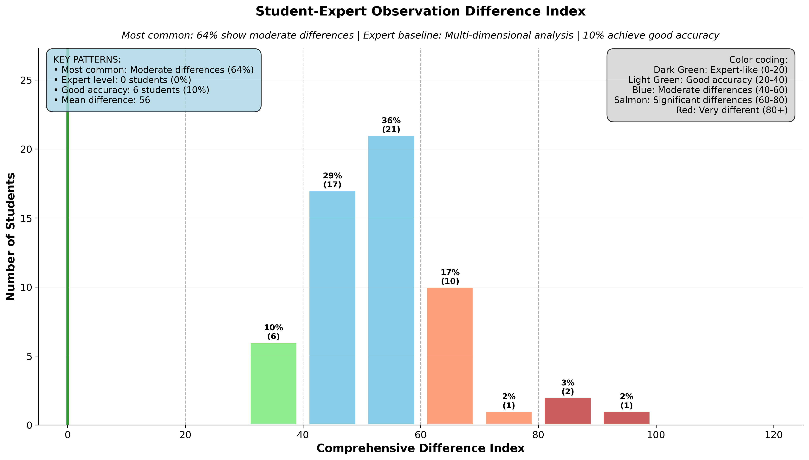

# Comprehensive Difference Index Analysis

## Takeaway
Students show systematic differences from Professor Caroline's expert observation patterns across multiple dimensions. The comprehensive difference index reveals that most students (64%) demonstrate moderate differences from the expert baseline, while only 10% achieve expert-like or good observation accuracy. This multi-dimensional analysis captures content accuracy, temporal alignment, quantitative precision, and behavioral consistency.

## What's Important About This Figure
This comprehensive metric provides a holistic view of observation accuracy by combining multiple dimensions:
- Content accuracy (what actions/strategies were observed)
- Temporal alignment (when behaviors were observed)
- Quantitative precision (how many behaviors were counted)
- Behavioral consistency (pattern matching with expert)

The index reveals that observation skills are multifaceted and most students struggle across several dimensions simultaneously.

## Original Filename
`observation2_comprehensive_difference_index.png`

## Related Figures
- [Student Distribution vs Expert](../Student_Distribution_vs_Expert/) - Shows the quantitative differences in action counts
- [Over/Under Observed Analysis](../Over_Under_Observed_Analysis/) - Details which specific behaviors are misobserved

## Code
*Note: The specific code that generated this figure was not found in the repository. This appears to be generated by a comprehensive analysis script that combines multiple observation metrics.*

## Figure

