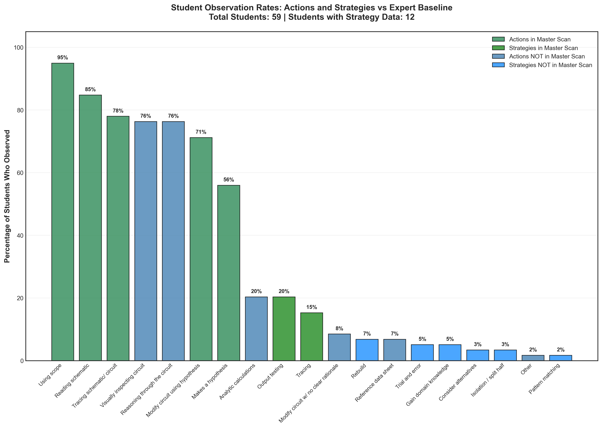

# Over/Under Observed Analysis

## Takeaway
This analysis compares student observation rates against the expert baseline (ECE_MasterScan). Actions and strategies observed by students are categorized by whether they appeared in the master scan (ground truth) or not, revealing patterns of over-observation and under-observation.

Key findings: 59 total students analyzed, with 12 having strategy data from NEW observation sheets.

## What's Important About This Figure
This visualization provides crucial insights into observation accuracy:
- Identifies which specific behaviors students tend to over-observe (see things that didn't happen)
- Reveals which behaviors students miss (under-observe)
- Distinguishes between accurate observations and false positives
- Helps identify where observation training should focus

## Original Filename
`over_under_observed_analysis.png`

## Related Figures
- [Student Distribution vs Expert](../Student_Distribution_vs_Expert/) - Shows overall observation count differences
- [Comprehensive Difference Index](../Comprehensive_Difference_Index/) - Provides multi-dimensional accuracy assessment
- [Continued Results Version](../../Additional_Analyses/Continued_Results/Over_Under_Observed_Analysis/) - Updated analysis with refined methodology

## Code
See the full code in [code.py](./code.py)

## Figure

