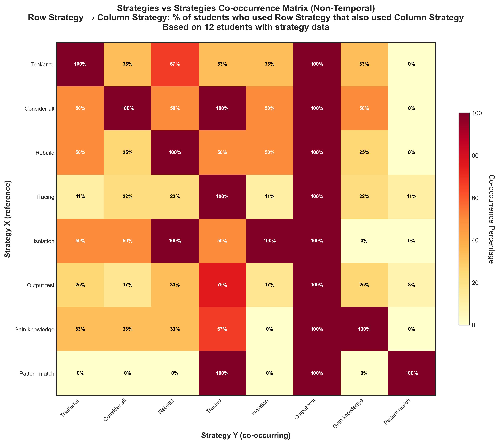

# Strategies Non-Temporal Co-occurrence

## Takeaway
Non-temporal co-occurrence matrix showing when strategies occur together across a student's entire session. Each cell shows: "Of students who used Row Strategy anywhere, what percentage also used Column Strategy anywhere?"

Analysis limited to 12 students with strategy data (NEW observation sheets). Diagonal shows 100% (students always co-occur with themselves).

## What's Important About This Figure
This analysis reveals patterns in strategic thinking observation:
- Shows which strategies tend to be observed by the same students
- Reveals whether students see troubleshooting as using multiple strategies or single approaches
- Limited to 12 students due to data collection methodology change
- Helps identify strategy clusters in student mental models

## Original Filename
`strategies_vs_strategies_nontemporal_cooccurrence.png`

## Related Figures
- [Strategies Temporal Cooccurrence](../Strategies_Temporal_Cooccurrence/) - Shows strategies occurring in the same step
- [Action NonTemporal Cooccurrence](../Action_NonTemporal_Cooccurrence/) - Similar analysis for actions

## Code
See the full code in [code.py](./code.py)

## Figure

