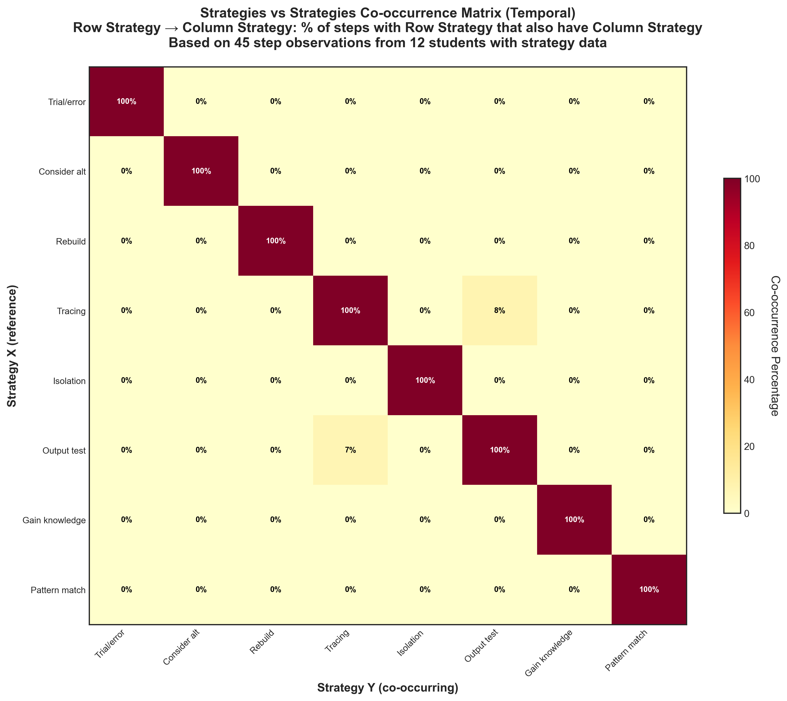

# Strategies Temporal Co-occurrence

## Takeaway
Temporal co-occurrence matrix showing when strategies occur together in the same step. Each cell shows: "Of steps where Row Strategy occurred, what percentage also had Column Strategy?"

Analysis limited to 12 students with strategy data (NEW observation sheets). Based on 45 step observations from these students. Diagonal shows 100% (strategies always co-occur with themselves).

## What's Important About This Figure
This visualization provides insights into strategic complexity:
- Reveals whether students observe multiple strategies being employed simultaneously
- Shows which strategies are seen as complementary vs. mutually exclusive
- Limited sample highlights the data collection methodology issue
- Indicates how students conceptualize strategic troubleshooting approaches

## Original Filename
`strategies_vs_strategies_temporal_cooccurrence.png`

## Related Figures
- [Strategies Non-Temporal](../Strategies_NonTemporal_Cooccurrence/) - Shows overall strategy relationships
- [Strategies vs Actions Temporal](../Strategies_vs_Actions_Temporal/) - Shows strategy-action relationships
- [July 17 Temporal Plus1](../../Additional_Analyses/July_17_Results/Strategies_Temporal_Plus1/) - Advanced temporal analysis

## Code
See the full code in [code.py](./code.py)

## Figure

