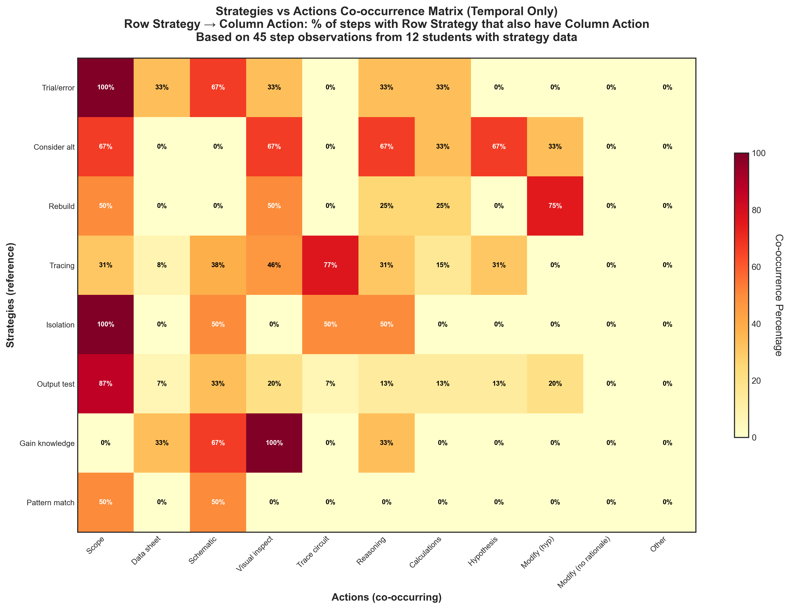

# Strategies vs Actions Temporal Co-occurrence

## Takeaway
Temporal co-occurrence matrix showing when strategies and actions occur together in the same step. Each cell shows: "Of steps where Row Strategy occurred, what percentage also had Column Action?"

Analysis limited to 12 students with strategy data (NEW observation sheets). Based on 45 step observations from these students.

## What's Important About This Figure
This visualization reveals the relationship between high-level strategies and specific actions:
- Shows which actions students associate with particular troubleshooting strategies
- Reveals whether students correctly identify the tactical implementations of strategic approaches
- Limited sample size (12 students) due to observation sheet versioning issue
- Helps understand how students conceptualize the strategy-action relationship

## Original Filename
`strategies_vs_actions_temporal_cooccurrence.png`

## Related Figures
- [Action Temporal Cooccurrence](../Action_Temporal_Cooccurrence/) - Shows action-to-action relationships
- [Strategies Temporal Cooccurrence](../Strategies_Temporal_Cooccurrence/) - Shows strategy-to-strategy relationships

## Code
See the full code in [code.py](./code.py)

## Figure

