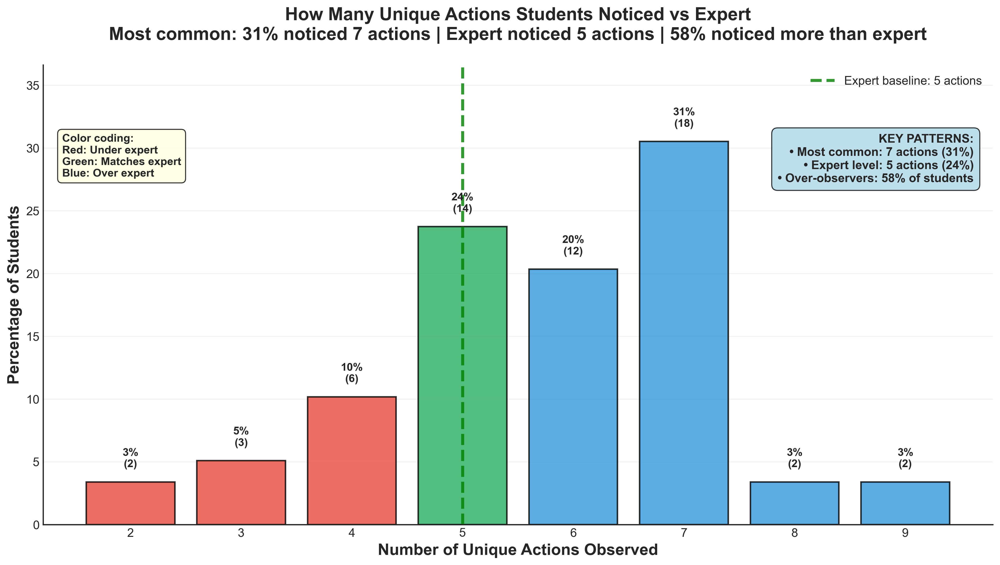

# Student Distribution vs Expert Analysis

## Takeaway
Most students observed more troubleshooting actions than actually occurred in the video. While Professor Caroline identified 5 actions when reviewing her own troubleshooting session, 58% of students reported seeing more actions than this baseline. The most common student response was 7 actions, suggesting systematic over-interpretation of troubleshooting behavior.

## What's Important About This Figure
This figure is crucial for understanding observation accuracy in engineering education. It reveals:
- A systematic bias toward over-observation in novice engineers
- The gap between expert and novice perception of troubleshooting activities
- Potential implications for how students learn from demonstrations and peer observation
- The need for training in accurate observation skills

## Original Filename
`observation1_student_distribution_vs_expert.png`

## Related Figures
- [Comprehensive Difference Index](../Comprehensive_Difference_Index/) - Quantifies the overall difference between student and expert observations
- [Too Many Strategies Noticed](../Too_Many_Strategies_Noticed/) - Similar analysis for strategy observations

## Code
*Note: The specific code that generated this figure was not found in the repository. This appears to be generated by a separate analysis script focusing on the observation patterns.*

## Figure

