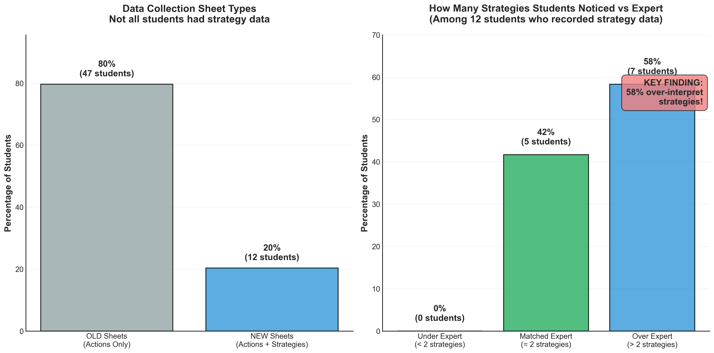

# Too Many Strategies Noticed Analysis

## Takeaway
Students over-interpret strategic thinking in addition to actions. Among students who recorded strategy data, 58% identified more strategic approaches than Professor Caroline noted in her own troubleshooting session. This pattern suggests students project complexity onto troubleshooting behavior, seeing deliberate strategy where experts recognize more straightforward problem-solving.

## What's Important About This Figure
This analysis reveals a critical insight about novice observation patterns:
- Students tend to attribute more strategic thinking to troubleshooting than actually exists
- This over-attribution may reflect students' own mental models of "good" troubleshooting
- The pattern parallels the over-observation of actions, suggesting a systematic bias
- Has implications for how students learn from expert demonstrations

## Original Filename
`observation3_too_many_strategies_noticed.png`

## Related Figures
- [Student Distribution vs Expert](../Student_Distribution_vs_Expert/) - Shows similar over-observation pattern for actions
- [Over/Under Observed Analysis](../Over_Under_Observed_Analysis/) - Details which specific strategies are over-observed

## Code
*Note: The specific code that generated this figure was not found in the repository. This analysis focused on the subset of students who had access to the strategy section of the observation sheet.*

## Figure

