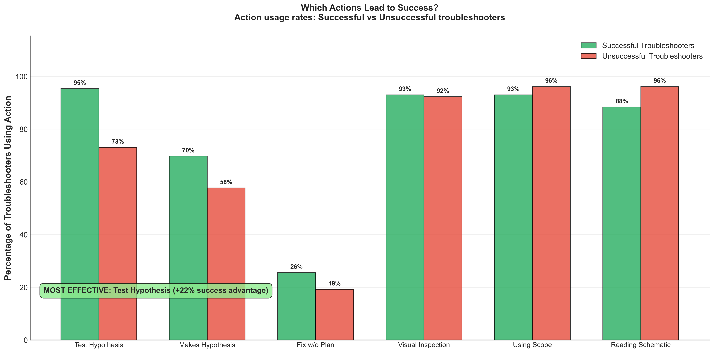

# Action Effectiveness Finding 3

## Takeaway
Hypothesis-driven repairs show the strongest correlation with troubleshooting success: 95% of successful students used this approach versus only 73% of unsuccessful ones. While unsuccessful troubleshooters read schematics more frequently (96% vs 88%), successful students excel at translating theoretical understanding into targeted fixes. The key difference lies in forming clear hypotheses before making circuit modifications.

## What's Important About This Figure
This analysis identifies the critical action that separates successful from unsuccessful troubleshooters:
- **Hypothesis Formation**: The most predictive factor for success
- **Theory-Practice Translation**: Reading schematics alone isn't sufficient
- **Strategic Thinking**: Success requires connecting understanding to action
- **Teaching Focus**: Hypothesis formation should be emphasized in troubleshooting education

The paradox that unsuccessful students read schematics more suggests that passive analysis without actionable hypotheses is ineffective.

## Original Filename
`phase2_finding3_action_effectiveness.png`

## Related Figures
- [Success Patterns Finding 1](../Success_Patterns_Finding_1/) - Shows overall efficiency patterns
- [Troubleshooting Approaches Finding 2](../Troubleshooting_Approaches_Finding_2/) - Shows sequential patterns

## Code
*Note: The specific code that generated this figure was not found in the repository. This analysis focuses on correlating specific actions with success outcomes in Phase 2 data.*

## Figure

