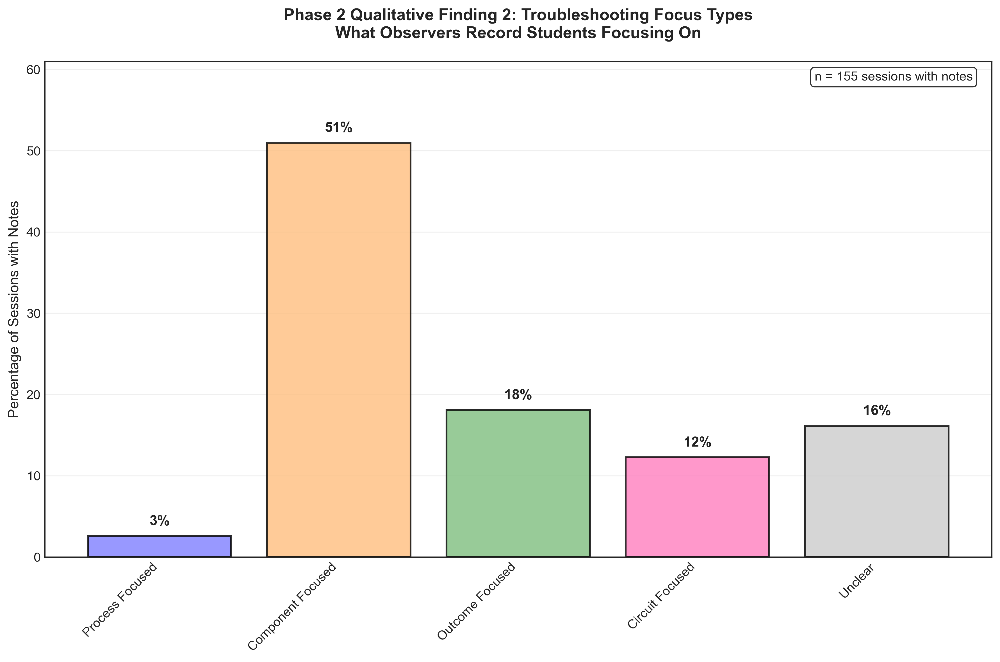

# Focus Types Qualitative Analysis 2

## Takeaway
Students concentrate their troubleshooting attention in three main areas: component analysis (43%), outcome verification (31%), and circuit-level understanding (15%). Component-focused troubleshooters examine individual parts and connections, while outcome-focused students emphasize measuring circuit outputs. Process-focused approaches, representing 11% of sessions, involve systematic methodology discussion.

## What's Important About This Figure
This qualitative analysis reveals diverse troubleshooting focus strategies:
- **Component Focus** (43%): Detail-oriented approach examining individual parts
- **Outcome Focus** (31%): Results-oriented approach emphasizing measurements
- **Circuit Understanding** (15%): System-level approach considering overall design
- **Process Focus** (11%): Methodology-oriented approach discussing systematic steps

These focus types may represent different learning styles or expertise levels in troubleshooting.

## Original Filename
`phase2_qualitative2_focus_types.png`

## Related Figures
- [Success Patterns Finding 1](../Success_Patterns_Finding_1/) - Shows which focus types correlate with success
- [Action Effectiveness Finding 3](../Action_Effectiveness_Finding_3/) - Shows specific actions within each focus type

## Code
*Note: The specific code that generated this figure was not found in the repository. This analysis appears to be based on qualitative coding of Phase 2 observation sessions.*

## Figure

