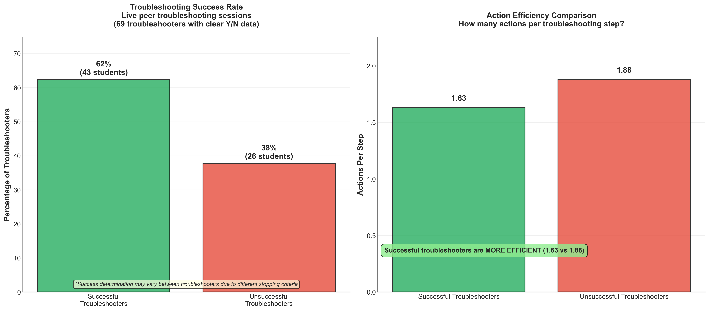

# Success Patterns Finding 1

## Takeaway
Successful troubleshooters used fewer actions per step than unsuccessful ones (1.63 vs 1.88 actions per step). Among students attempting the circuit repair, 49% succeeded while 30% failed to fix the problem. Effective troubleshooting appears to rely on focused, methodical actions rather than extensive trial-and-error approaches.

## What's Important About This Figure
This analysis reveals a key insight about troubleshooting effectiveness:
- **Quality over Quantity**: Successful troubleshooters are more focused and deliberate
- **Action Efficiency**: Lower action density correlates with better outcomes
- **Strategic Focus**: Success comes from targeted approaches rather than scattered attempts
- **Learning Implications**: Teaching efficiency and focus may be more important than comprehensive action lists

## Original Filename
`phase2_finding1_success_patterns.png`

## Related Figures
- [Troubleshooting Approaches Finding 2](../Troubleshooting_Approaches_Finding_2/) - Shows the sequential patterns students follow
- [Action Effectiveness Finding 3](../Action_Effectiveness_Finding_3/) - Details which specific actions correlate with success

## Code
*Note: The specific code that generated this figure was not found in the repository. This appears to be generated by Phase 2 analysis scripts focusing on live peer observation data.*

## Figure

