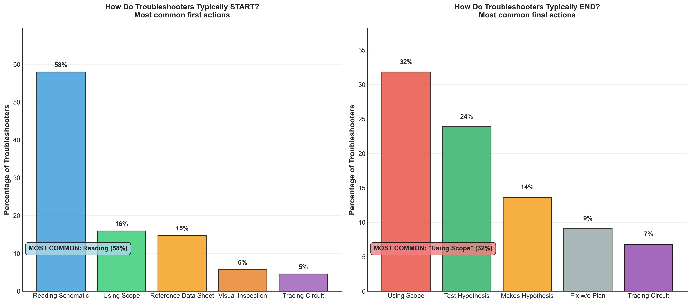

# Troubleshooting Approaches Finding 2

## Takeaway
Students follow a consistent troubleshooting sequence: 58% begin by reading the schematic while 32% conclude with oscilloscope measurements. This reveals a "theory-first, measurement-last" approach where students start with understanding the intended design and finish by verifying actual circuit behavior. The pattern suggests students naturally progress from conceptual analysis to empirical testing.

## What's Important About This Figure
This finding reveals fundamental troubleshooting pedagogy insights:
- **Natural Progression**: Students intuitively follow a logical sequence from theory to practice
- **Consistent Methodology**: Strong patterns emerge despite individual differences
- **Pedagogical Validation**: Student approaches align with expert troubleshooting methodology
- **Design Implications**: Curriculum should build on this natural progression

The "theory-first, measurement-last" pattern suggests students understand the value of preparation before testing.

## Original Filename
`phase2_finding2_troubleshooting_approaches.png`

## Related Figures
- [Success Patterns Finding 1](../Success_Patterns_Finding_1/) - Shows efficiency patterns in successful troubleshooting
- [Action Effectiveness Finding 3](../Action_Effectiveness_Finding_3/) - Details which actions correlate with success

## Code
*Note: The specific code that generated this figure was not found in the repository. This analysis focuses on sequential patterns in Phase 2 live observation data.*

## Figure

